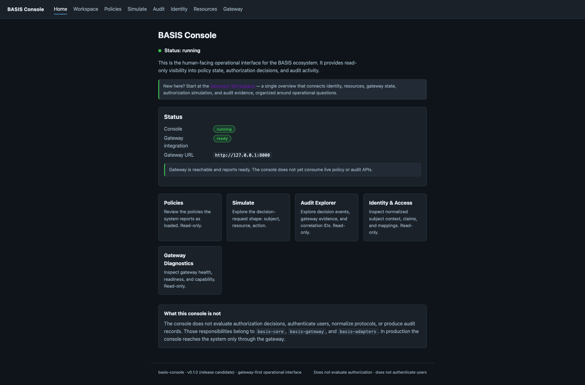
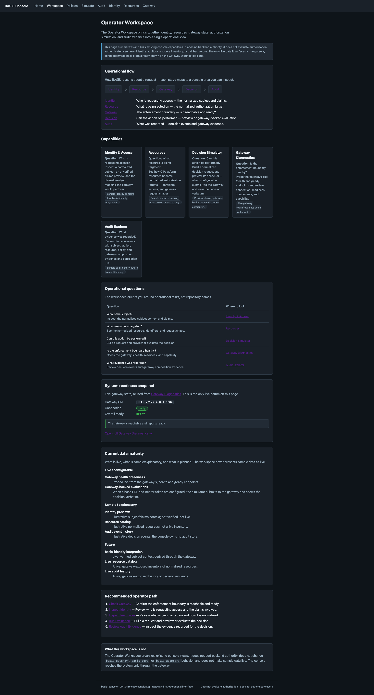
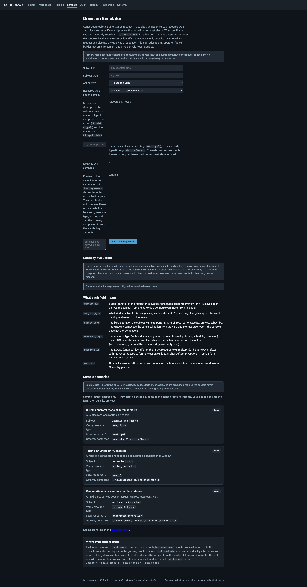
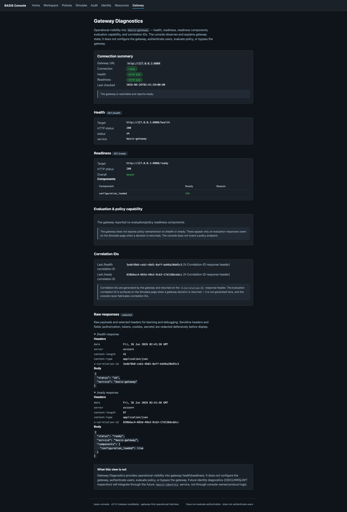

# basis-console

`basis-console` is the **human-facing operational interface** for the BASIS
ecosystem. It gives operators a single place to understand and operate
identity-aware authorization: see whether the enforcement boundary is healthy,
inspect how identity, resources, actions, and decisions fit together, construct a
well-formed authorization request and — when configured — submit it through the
gateway and read the decision.

The console is **read-oriented and gateway-first**. It observes, inspects,
submits requests through `basis-gateway`, and explains the model. It does **not**
evaluate authorization, authenticate users, own identity, store audit records, or
own resource inventory.

```
basis-console is a human-facing operational interface.
It does not evaluate authorization decisions.
It does not authenticate users.
It reaches the system only through basis-gateway — never basis-core directly.
```

> **Status: v0.1.0 release candidate.** The console's interaction patterns,
> boundaries, documentation, and quality gates are stable enough for early
> adopters to evaluate. This is **not** a production-ready, audited, or hardened
> deployment artifact. See [`docs/releases/v0.1.0.md`](docs/releases/v0.1.0.md).

---

## What it is

- A **human-facing interface layer** that makes the authorization system
  understandable and operable.
- A **read-oriented** window onto policy state, decision outcomes, audit evidence,
  identity context, resources, and gateway health.
- A **gateway-first** application: live data comes from `basis-gateway`, and the
  console degrades honestly when the gateway is unavailable.
- A deployable operational web app designed to run in cloud, on-prem, and
  air-gapped environments — all static assets are served locally, no CDN.

## What it is not

The console renders information and submits requests through enforced boundaries.
It never becomes the system behind the interface. Specifically, it does **not**:

- evaluate authorization decisions — that belongs to `basis-core`;
- authenticate users, manage sessions, or verify tokens — that belongs to
  `basis-gateway` and the identity providers it trusts;
- normalize or speak field protocols (BACnet, Modbus, MQTT, …) — that belongs to
  `basis-adapters`;
- produce, store, or reinterpret audit records — those come from `basis-core` and
  `basis-gateway`;
- own a resource inventory or discover devices;
- bypass the gateway to reach the kernel directly.

See [`docs/architecture.md`](docs/architecture.md) for the full set of boundaries
and design invariants, and [`CONTRIBUTING.md`](CONTRIBUTING.md) for what is in and
out of scope for the console.

---

## Quickstart

**Requirements:** Python 3.10+. No internet access, cloud account, or external
service is required to run the console.

```bash
# from the repository root
python -m venv .venv
source .venv/bin/activate
pip install -e ".[dev]"      # or: make install

make run                     # uvicorn on 127.0.0.1:8080 (honors HOST / PORT)
```

Then open <http://127.0.0.1:8080/>. The status page should report
`Status: running`, and the gateway integration will show `not_configured` — the
console is running in **sample-only mode**.

## Run modes

The console works with or without a gateway. Behavior is driven entirely by
configuration:

**Sample-only mode (default).** No `GATEWAY_BASE_URL`. Every page loads;
data-bearing pages render clearly-labelled sample data; gateway status is
`not_configured`. Nothing is contacted over the network.

```bash
make run
```

**Gateway mode.** `GATEWAY_BASE_URL` points at a `basis-gateway` instance. The
home page, Operator Workspace, and Gateway Diagnostics reflect live gateway
health/readiness, probed only via the gateway's `GET /health` and `GET /ready`.

```bash
GATEWAY_BASE_URL=http://127.0.0.1:8000 make run
```

**Live evaluation mode.** `GATEWAY_BASE_URL` **and** `GATEWAY_BEARER_TOKEN` are
set. The Decision Simulator can additionally submit to the gateway's
`POST /v1/evaluate` and display the decision verbatim. A bearer token is required
because the gateway derives the subject identity from the verified token and
rejects unauthenticated calls; obtain one out-of-band — the console does no OIDC
login and issues no tokens. When the token is absent, the simulator stays
preview-only and says so.

```bash
GATEWAY_BASE_URL=http://127.0.0.1:8000 \
GATEWAY_BEARER_TOKEN="<token-obtained-out-of-band>" \
make run
```

## Configuration

All configuration comes from environment variables with safe local defaults.
Nothing is hardcoded to a public URL or SaaS endpoint.

| Variable                  | Default         | Purpose                                                        |
| ------------------------- | --------------- | -------------------------------------------------------------- |
| `HOST`                    | `127.0.0.1`     | Bind address. Set `0.0.0.0` (or a specific interface) **only** behind a reverse proxy. |
| `PORT`                    | `8080`          | Bind port.                                                     |
| `LOG_LEVEL`               | `INFO`          | One of DEBUG, INFO, WARNING, ERROR, CRITICAL.                  |
| `ENVIRONMENT`             | `local`         | One of local, development, staging, production.                |
| `GATEWAY_BASE_URL`        | _(unset)_       | Base URL of `basis-gateway`. Unset → `not_configured`, sample-only mode, no network call. No public URL is baked in. |
| `GATEWAY_TIMEOUT_SECONDS` | `2.0`           | Timeout for gateway `/health`, `/ready`, and `/v1/evaluate` calls. Must be > 0. |
| `GATEWAY_BEARER_TOKEN`    | _(unset)_       | Optional **server-side** token enabling gateway-backed evaluation. Sent only as `Authorization: Bearer <token>` to `/v1/evaluate`; **never** displayed, logged, or rendered. For local/dev/operator-controlled use. |
| `SERVICE_NAME`            | `basis-console` | Service name reported by health/readiness.                     |

The console is designed to sit behind a reverse proxy (Nginx, Caddy, or a cloud
load balancer) and serves all static assets locally, so it works in air-gapped
deployments. Because the console authenticates no one itself, any deployment
reachable beyond a trusted operator must be fronted by appropriate access
controls — see [`SECURITY.md`](SECURITY.md).

## Page map

| Method | Path                 | Type | Purpose                                                       | Data |
| ------ | -------------------- | ---- | ------------------------------------------------------------ | ---- |
| GET    | `/health`            | JSON | Liveness probe.                                              | live |
| GET    | `/ready`             | JSON | Readiness probe; includes gateway connectivity state.       | live |
| GET    | `/`                  | HTML | Home / status page; gateway status panel; links to Workspace. | live |
| GET    | `/workspace`         | HTML | Operator Workspace / Overview — orientation across all areas. | live + sample |
| GET    | `/policies`          | HTML | Policy viewer.                                               | sample |
| GET    | `/simulate`          | HTML | Decision-simulator request builder (optional `?example=`).  | preview |
| POST   | `/simulate`          | HTML | Preview mode (build request shape) or gateway mode (`mode=gateway`, forward to `/v1/evaluate`). | preview + live |
| GET    | `/simulate/examples` | HTML | Sample simulator scenarios.                                 | sample |
| GET    | `/audit`             | HTML | Audit Explorer — decision events + gateway evidence.         | sample (+ live via Simulate) |
| GET    | `/identity`          | HTML | Identity & Access Explorer.                                  | sample |
| GET    | `/resources`         | HTML | Resource Explorer — resources, identifiers, request shapes.  | sample |
| GET    | `/gateway`           | HTML | Gateway Diagnostics — live gateway health/readiness.         | live |

Sample-labelled pages render illustrative data only; the console never presents
sample data as authoritative system state and never produces an allow/deny
decision of its own.

## Screenshots

> _Screenshots are pending for the `v0.1.0` release. Add operator-facing captures
> of the Home, Operator Workspace, Decision Simulator, and Gateway Diagnostics
> pages here (for example under `docs/images/`). Until then, run the console
> locally with `make run` to see each page._

<!--




-->

---

## Architecture and boundaries

The console preserves BASIS layering. Operator actions flow one way, and the
gateway enforces the appropriate boundary before reaching the kernel:

```
Operator → basis-console → basis-gateway → basis-core
```

- **Gateway-first.** The `basis_console.gateway` package is the single egress
  point and talks only to the gateway's HTTP surface (`/health`, `/ready`, and —
  when configured — `/v1/evaluate`). The console never imports `basis-core`.
- **No local authorization.** When the gateway is unreachable, the console
  surfaces nothing live and never substitutes local authorization logic or cached
  decisions.
- **Identity boundary.** For live evaluation, the gateway derives the subject from
  its verified bearer token; the console sends no subject. The simulator's subject
  fields are preview-only.
- **Relay, don't reinterpret.** The console displays the gateway's decision and
  composition evidence verbatim.

The full boundary set, the gateway/kernel/adapter relationships, and the
phase-by-phase design notes live in [`docs/architecture.md`](docs/architecture.md).

## Development

```bash
make test        # python -m pytest
make lint        # ruff check .
make format      # ruff format --check .
make typecheck   # mypy src (strict mode)
make check       # all four gates
make run         # dev server (HOST / PORT env vars)
```

Contributions are welcome — please read [`CONTRIBUTING.md`](CONTRIBUTING.md)
(setup, quality gates, and the boundaries every change must respect) and
[`CODE_OF_CONDUCT.md`](CODE_OF_CONDUCT.md). Report suspected security issues
privately per [`SECURITY.md`](SECURITY.md).

## Documentation

- [`docs/architecture.md`](docs/architecture.md) — console boundaries, invariants,
  and phase notes.
- [`docs/releases/v0.1.0.md`](docs/releases/v0.1.0.md) — release notes for the
  `v0.1.0` candidate.
- [`docs/release-checklist.md`](docs/release-checklist.md) — what must be true to
  tag a release.
- [`docs/smoke-test.md`](docs/smoke-test.md) — manual smoke test for each run mode.
- [`CHANGELOG.md`](CHANGELOG.md) — notable changes.

## Repository structure

```
basis-console/
  src/basis_console/
    main.py            # FastAPI app factory + lifespan
    config.py          # environment-driven configuration
    readiness.py       # readiness state tracker
    sample_data.py     # read-only SAMPLE data for placeholder views + scenarios
    simulator.py       # decision-simulator validation + preview/request builder
    identity.py        # Identity & Access Explorer presentation models + SAMPLE data
    diagnostics.py     # Gateway Diagnostics aggregator / presentation model
    audit.py           # Audit Explorer presentation models + SAMPLE events
    resources.py       # Resource Explorer presentation models + SAMPLE resources
    workspace.py       # Operator Workspace presentation models + orientation content
    vocabulary.py      # provisional console-local action vocabulary bridge
    gateway/           # gateway client abstraction (single egress)
      client.py        #   httpx /health + /ready probes, /v1/evaluate, diagnostics
      models.py        #   GatewayStatus / GatewayEvaluation* / GatewayProbeResult
      redaction.py     #   defensive redaction of sensitive headers/fields
    api/routes.py      # /health, /ready (JSON, incl. gateway state)
    ui/views.py        # HTML views for all pages
    ui/templates/      # Jinja2 templates
    ui/static/         # locally served CSS (no CDN)
  tests/               # health, routes, config, gateway, simulator, eval tests
  docs/                # architecture, releases, release checklist, smoke test
  pyproject.toml
  Makefile
```

## License

Apache License 2.0 — see [`LICENSE`](LICENSE).
